# Luồng Nghiệp vụ: Tạo Đơn Hàng (Order Flow) - Cập nhật

Luồng Đơn hàng (`CreateOrderCommand`) hiện đóng vai trò là một **Internal Service (Dịch vụ nội bộ)**. Thay vì được gọi trực tiếp từ Client, nó thường được kích hoạt bởi **Checkout Module** sau khi giỏ hàng đã được xác thực an toàn.

## 📝 Chi tiết quy trình nghiệp vụ

### 1. Phân tách Trách nhiệm
Ngược lại với Giỏ hàng (Cart) mang tính chất "Mô phỏng", Đơn hàng (Order) là một **Hối phiếu có giá trị pháp lý**. Mọi thông tin tại đây (Variant ID, Quantity, UnitPrice) đều là bản sao bất biến (Immutable Snapshot) của dữ liệu tại thời điểm Checkout.

### 2. Chuỗi Saga & Giao dịch bù đắp (Compensating)
- Khi nhận lệnh `CreateOrderCommand`, Handler lặp qua từng món hàng.
- **Duy trì Tồn kho:** Gọi `InventoryService.reserveInventory` (đồng bộ).
- **Trường hợp Lỗi:** Nếu bất kỳ món nào hết hàng giữa chừng, toàn bộ các món đã "đặt gọc" thành công trước đó sẽ được gọi hàm `releaseInventory` ngay lập tức để trả hàng cho kho.

### 3. Sự kiện chuyển tiếp (Event-Driven)
- Sau khi lưu Database thành công, ném ra `OrderCreatedEvent`.
- **BullMQ Workers:** Nhận sự kiện và chạy ngầm (Background) để trừ vĩnh viễn tồn kho vật lý. Bước này tách rời để tăng tốc độ phản hồi cho khách hàng.

## 📊 Biểu đồ tuần tự (Sequence Diagram)

```mermaid
sequenceDiagram
    autonumber
    participant Checkout as Checkout Module
    participant Handler as CreateOrderHandler
    participant InvSrv as Inventory (Sync)
    participant DB as Order DB
    participant Bus as EventBus / Redis

    Checkout->>Handler: execute(internal CreateOrderCommand)
    
    rect rgb(45, 45, 55)
    Note right of Handler: Giai đoạn Saga: Giữ cọc
    loop Từng món hàng
        Handler->>InvSrv: reserveInventory(sku, qty)
        InvSrv-->>Handler: Thành công hoặc Lỗi
        alt Nếu Hết hàng / Lỗi
            Handler->>InvSrv: releaseInventory() cho các món ĐÃ CỌC
            Handler-->>Checkout: Ném lỗi 400 (Rollback xong)
        end
    end
    end
    
    Handler->>DB: TypeORM: Lưu Order & OrderItems
    
    Handler->>Bus: publish(OrderCreatedEvent)
    
    Handler-->>Checkout: Trả về savedOrder
```

