# Luồng Nghiệp vụ: Tạo Đơn Hàng (Create Order Flow)

Luồng tạo đơn hàng là chức năng phức tạp nhất vì nó liên quan chặt chẽ đến sự sống còn của số lượng hàng hóa. Tại đây, hệ thống áp dụng kỹ thuật **Saga Pattern** (*Compensating Transactions*) để xử lý tình trạng "cháy kho nửa chừng" mà không để lại dữ liệu rác.

## 📝 Chi tiết 3 Pha cốt lõi

### Pha 1: Giữ chỗ Đồng bộ (Synchronous Reservation)
- Khi Client đẩy rổ hàng vào `POST /orders`, hệ thống giải mã một mảng các Item (mỗi Item gồm `SKU` + `Quantity`). Đưa cho `CreateOrderCommand`.
- Tại `CreateOrderHandler`, thay vì lưu DB rầm rầm, hệ thống sẽ **Dạo quanh cửa kho một vòng**: Lặp qua từng Item, gọi trực tiếp bộ cấp phép `InventoryService.reserveInventory()` để đóng dấu "Cọc Giữ Hàng".
- Những linh kiện lấy cọc thành công được cất tạm vào mảng `successfullyReservedSkus`.
- ⚠️ **Rủi ro cháy kho (Sự Cố):** Trong vòng lặp, lỡ có một món bị lạm phát (đòi nhiều hàng hơn số có trong kho). Hàm văng lỗi. Nhờ vòng **try/catch**, Handler lập tức gọi bù trừ lệnh `releaseInventory()` (Nhả Cọc) cho danh sách các món ĐÃ cọc trước đó để hoàn trả nguyên trạng nhà kho. Gửi thẳng mã `HTTP 400` về mặt Client.

### Pha 2: Chốt Đơn & Ký Giấy (Synchronous Order Creation)
- Nếu toàn bộ các món hàng trong mâm đều vượt biên qua trạm kiểm định an toàn. Handler chính thức ban hành sắc lệnh: Tạo Record `Order` Mẹ, tạo các `LineItems` Con trực tiếp xuống Bảng Cơ sở Dữ Liệu (*Lưu DB Order*). 

### Pha 3: Dọn dẹp Hậu trường (Asynchronous Deduction)
- Đơn hàng đã chốt thì tiền đã trao. Lúc này Handler gói toàn bộ danh sách `successfullyReservedSkus` (list các món chốt cọc) vào cái Event có tên `OrderCreatedEvent` và quăng lên hệ thống **EventBus**. Báo cho Client kết thúc quá trình: Thành Công (HTTP 201)!
- Ở hệ thống nền (Background Redis/BullMQ), một Queue đánh hơi nhận Event này. Đẩy thành dạng job tên là `reduce-stock-job`.
- **Inventory Worker** húp Job này, chạy lệnh `deductInventory`: Ở lệnh này, Worker sẽ trừ vĩnh viễn sinh mệnh của mã hàng đó trên cột `stockedQuantity`, đồng thời xóa bỏ cái xích tạm trữ bên cột `reservedQuantity`.

## 📊 Biểu đồ tuần tự (Sequence Diagram)

```mermaid
sequenceDiagram
    autonumber
    actor Client
    participant Ctrl as OrderController
    participant Handler as CreateOrderHandler
    participant InvSrv as InventoryService (Sync)
    participant DB as Order Database
    participant Bus as EventBus / BullMQ
    participant Worker as Inventory Worker (Async)

    Client->>Ctrl: POST /orders (Items[{sku, qty}])
    Ctrl->>Handler: execute(CreateOrderCommand)
    
    rect rgb(40, 50, 45)
    Note right of Handler: PHA 1: SYNCHRONOUS RESERVATION (GIỮ CHỖ)
    loop For each Item
        Handler->>InvSrv: reserveInventory(sku, quantity)
        InvSrv-->>Handler: Trả về OK hoặc Exception (Hết Hàng)
        
        alt Nếu Hết Hàng (Bão Lỗi)
            Handler->>InvSrv: releaseInventory() cho các Item ĐÃ CỌC (Compensating SAGA)
            Handler-->>Client: Báo lỗi Hết Kho (HTTP 400) - TỪ CHỐI TẠO ĐƠN
        end
    end
    end
    
    rect rgb(50, 30, 45)
    Note right of Handler: PHA 2: CHỐT ĐƠN VÀ LƯU DATABASE
    Handler->>DB: TypeORM save(Order & Items)
    DB-->>Handler: Commit Thành Công
    end
    
    rect rgb(35, 45, 60)
    Note right of Handler: PHA 3: SỰ KIỆN HẬU TRƯỜNG & KHÁCH RỜI ĐI
    Handler->>Bus: publish( OrderCreatedEvent(orderId, successfullyReservedSkus) )
    Handler-->>Client: Trả về thông tin Đơn hàng (HTTP 201)
    
    Bus-->>Worker: Route Event thành job 'reduce-stock-job' trên Redis Queue
    Note right of Bus: Lúc này Client không bị Bắt Đợi thao tác này nữa
    
    Worker->>Worker: Worker bắt đầu Processing Job
    loop For each Item đã chốt
        Worker->>InvSrv: deductInventory(sku, quantity)
        Note right of InvSrv: Xóa số lượng trên Cột Reserved<br>Trừ Vĩnh Viễn Tồn Kho trên Cột Stocked
    end
    end
```

