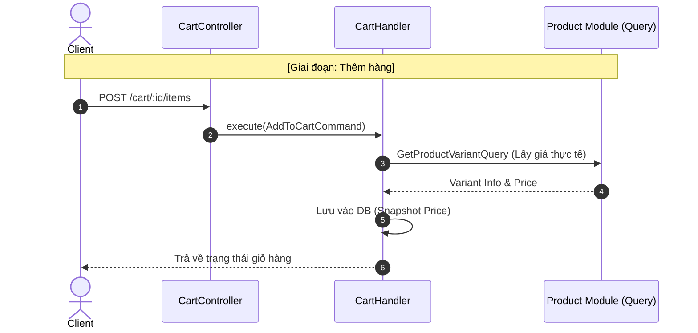

# Luồng Nghiệp vụ: Giỏ Hàng (Cart Flow) - Cập nhật

Giỏ hàng (Cart) là vùng đệm lưu trữ lựa chọn của khách hàng. Trong kiến trúc mới, Cart Module tập trung hoàn toàn vào việc quản lý thực thể giỏ hàng và cung cấp dữ liệu cho các module điều phối khác.

## 1. Cấu trúc Thực thể (Entities)

*   **Cart (Giỏ hàng):** 
    *   `id`: UUID.
    *   `completedAt`: Lưu thời điểm chốt đơn (Nếu không null -> Giỏ đã đóng).
*   **CartItem (Mặt hàng trong giỏ):** 
    *   `variant_id`: Liên kết sản phẩm.
    *   `unit_price`: **Snapshot price** (Chốt giá ngay lúc cho vào giỏ).

## 2. Các Query & Command quan quan trọng

Để hỗ trợ tính chất **Modular**, Cart Module cung cấp các "cổng giao tiếp":
*   **`GetCartQuery`:** Cho phép Checkout Module lấy toàn bộ thông tin giỏ hàng (bao gồm items) mà không cần truy cập trực tiếp vào Repository.
*   **`MarkCartAsCompletedCommand`:** Lệnh nội bộ để đóng giỏ hàng sau khi đơn hàng đã được tạo thành công.

## 📊 Biểu đồ tương tác

## ⚠️ Lưu ý về Checkout
Từ phiên bản này, luồng **Checkout** (Thanh toán) đã được chuyển sang **Checkout Module** để đảm bảo tính tách biệt trách nhiệm. Cart Module chỉ đóng vai trò cung cấp dữ liệu đầu vào.
