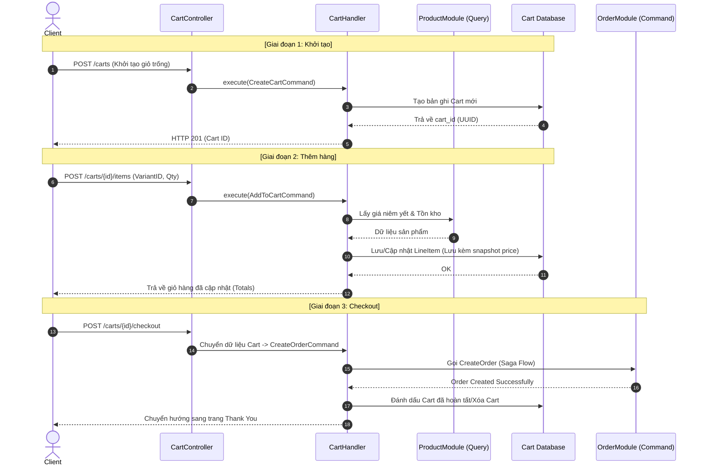

# Luồng Nghiệp vụ: Giỏ Hàng (Cart Flow)

Giỏ hàng (Cart) là "trái tim" của trải nghiệm mua sắm, đóng vai trò là vùng đệm lưu trữ lựa chọn của khách hàng trước khi chính thức chuyển đổi thành Đơn hàng (Order). Hệ thống được thiết kế để hỗ trợ cả **khách vãng lai (Anonymous)** và **khối khách hàng thành viên**.

## 1. Cấu trúc Thực thể (Entities)

Để quản lý giỏ hàng hiệu quả, chúng ta chia làm 2 thực thể chính:

*   **Cart (Giỏ hàng):** Chứa thông tin tổng quan như:
    *   `id`: Mã định danh duy nhất (thường dùng UUID để bảo mật).
    *   `customer_id`: Liên kết tới người dùng (Có thể để trống - Nullable).
    *   `email`: Lưu email khách hàng sẽ nhận thông báo.
    *   `region_id`: Dùng để tính toán thuế và đơn vị tiền tệ.
*   **LineItem (Mặt hàng trong giỏ):**
    *   `cart_id`: Thuộc về giỏ hàng nào.
    *   `variant_id`: Liên kết tới sản phẩm cụ thể.
    *   `quantity`: Số lượng.
    *   `unit_price`: Giá tại thời điểm cho vào giỏ (Snapshot price).

## 2. Chi tiết 3 Giai đoạn của Cart Flow

### Giai đoạn 1: Khởi tạo (Initialization)
- Khi khách hàng truy cập web lần đầu hoặc giỏ cũ đã hết hạn, Frontend gọi `POST /carts`.
- Hệ thống tạo một bản ghi `Cart` trống trong Database và trả về `cart_id`.
- **Lưu ý:** Lúc này chưa cần thông tin đăng nhập.

### Giai đoạn 2: Tương tác (Interaction - Add/Update)
- Khi khách bấm "Thêm vào giỏ":
    1.  Hệ thống gọi `GetProductVariantQuery` để lấy thông tin giá hiện tại.
    2.  Kiểm tra nhanh tồn kho (Inventory Check) xem còn hàng để cho vào giỏ không.
    3.  Lưu/Cập nhật vào bảng `LineItem`. Nếu món đó đã có sẵn, chỉ tăng `quantity`.
- **Pricing Engine (Máy tính giá):** Mỗi khi giỏ hàng thay đổi, hệ thống sẽ tính toán lại `subtotal` (tổng tiền hàng), `total` (sau thuế/ship) để hiển thị cho khách.

### Giai đoạn 3: Hoàn tất (Completion - Checkout)
- Đây là bước quan trọng nhất: **Chuyển đổi Giỏ hàng thành Đơn hàng**.
- Khi khách bấm "Thanh toán", hệ thống sẽ sử dụng dữ liệu từ `Cart` để tạo ra `CreateOrderCommand`.
- Một khi Order đã được tạo thành công, `Cart` này sẽ được đánh dấu là `completed` hoặc bị xóa để tránh việc khách thanh toán 2 lần cho cùng một giỏ.

## 📊 Biểu đồ tuần tự (Sequence Diagram)

## ⚠️ Lưu ý quan trọng
- **Snapshot Pricing:** Phải lưu giá tiền vào `LineItem` ngay lúc thêm vào giỏ. Nếu hệ thống chỉ lưu `variant_id` rồi lúc checkout mới đi xem giá, khách hàng sẽ cảm thấy bị lừa nếu giá sản phẩm tăng lên trong lúc họ đang cân nhắc mua.
- **Cart Expiry:** Giỏ hàng khách vãng lai nên có thời gian hết hạn (ví dụ 7 ngày) để định kỳ dọn dẹp Database.
