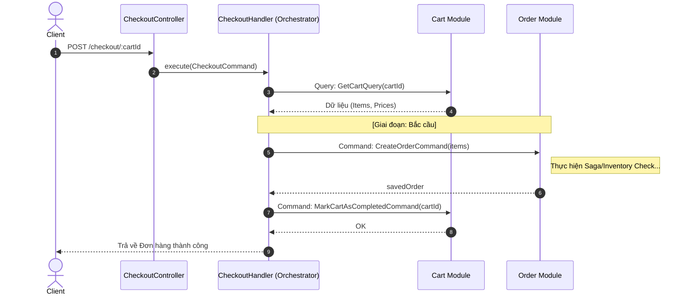

# Luồng Nghiệp vụ: Điều Phối Thanh Toán (Checkout Orchestration)

Checkout Module đóng vai trò là **"Nhà Điều Phối" (Orchestrator)** trong hệ thống. Nó không trực tiếp sở hữu dữ liệu người dùng hay hàng hóa, mà là cầu nối để chuyển đổi trạng thái từ Giỏ hàng (Cart) sang Đơn hàng (Order).

## 1. Trách nhiệm chính (Responsibility)

Luồng Checkout là nơi tập trung các logic "Bắc cầu" (Cross-cutting concerns):
*   **Xác thực Giỏ hàng:** Gọi sang Cart Module để lấy dữ liệu.
*   **Chuyển đổi Dữ liệu:** Map từ `CartItem` sang `OrderItem`.
*   **Kích hoạt Giao dịch:** Gọi sang Order Module để tạo hối phiếu chính thức.
*   **Dọn dẹp:** Sau khi giao dịch thành công, quay về đóng Giỏ hàng (đánh dấu `completedAt`).

## 2. Quy trình 04 Bước chi tiết

1.  **Lấy Hành Trang:** Nhận `cartId`, gọi `GetCartQuery` sang Cart Module.
2.  **Kiểm soát Biên giới:** Kiểm tra giỏ hàng có đồ hay không, đã thanh toán chưa. 
3.  **Ký Kết Hối Phiếu:** Đóng gói items gửi sang `CreateOrderCommand` (Order Module). Lúc này toàn bộ logic Saga/Trừ kho sẽ được kích hoạt tại Module Order.
4.  **Huỷ Thẻ Tạm:** Nếu Order thành công, gọi `MarkCartAsCompletedCommand` để khoá Giỏ hàng.

## 📊 Biểu đồ tuần tự (Sequence Diagram)

## ⚠️ Ưu điểm của kiến trúc này
*   **Decoupled Modules:** Cart và Order hoàn toàn không biết nhau. Nếu bạn thay đổi database của Cart, Order cũng không bị ảnh hưởng.
*   **Scalable:** Sau này khi có thêm Payment (Thanh toán), Shipping (Vận chuyển), chúng ta chỉ việc nhét thêm bước vào `CheckoutHandler` mà không làm phình to code của Cart hay Order.
