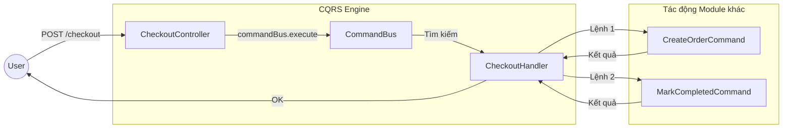

# Kiến trúc: Command Pattern & CQRS (Command Query Responsibility Segregation)

Hệ thống này sử dụng **Command Pattern** thông qua thư viện `@nestjs/cqrs` để đạt được sự tách biệt tối đa giữa các module và khả năng mở rộng trong tương lai.

## 1. Command Pattern là gì?

Command Pattern là một mẫu thiết kế hành vi, trong đó một yêu cầu được đóng gói thành một đối tượng độc lập chứa tất cả thông tin về yêu cầu đó. 

Trong dự án này, thay vì Controller trực tiếp gọi đến một Service cồng kềnh, nó chỉ gửi đi một **"Mệnh lệnh" (Command)**.

## 2. Các thành phần chính trong `src`

### 🏗️ A. Command (Lệnh)
Là một lớp (class) đơn giản chứa dữ liệu cần thiết để thực hiện một hành động. Nó không chứa logic xử lý.
*   *Ví dụ:* `AddToCartCommand(cartId, variantId, quantity)`
*   *Vị trí:* `src/modules/*/commands/**/*.command.ts`

### 🧠 B. Command Handler (Người thực thi)
Là nơi chứa logic nghiệp vụ thực tế. Mỗi Handler chỉ chịu trách nhiệm cho DUY NHẤT một Command.
*   *Quy tắc:* 1 Command = 1 Handler.
*   *Vị trí:* `src/modules/*/commands/**/*.handler.ts`

### 🚌 C. Command Bus (Xe buýt trung chuyển)
Là bộ điều phối trung tâm. Controller hoặc các Handler khác sẽ "ném" Command vào Bus, và Bus sẽ tự tìm đến Handler tương ứng để chạy.

---

## 3. Tại sao chúng ta dùng nó? (Lợi ích thực tế)

### ✅ Tách biệt trách nhiệm (Decoupling)
Hãy nhìn vào **Checkout Module**. Nó muốn tạo một Đơn hàng.
*   **Cách cũ:** `CheckoutService` phải inject `OrderService`, `InventoryService`, `CartService`... (Gây ra "Spaghetti Code").
*   **Cách CQRS:** `CheckoutHandler` chỉ cần inject `CommandBus`. Nó ném các "Lệnh" đi và không cần biết các module kia đang chạy DB gì hay logic phức tạp ra sao.

### ✅ Khả năng mở rộng (Scalability)
Nếu ngày mai bạn muốn tách `OrderModule` thành một Microservice riêng:
*   Bạn **không cần sửa code** ở `CheckoutModule`. Bạn chỉ cần cài đặt một `CommandBus` vận chuyển lệnh qua RabbitMQ hoặc Kafka thay vì chạy nội bộ.

### ✅ Dễ dàng Kiểm thử (Testability)
Vì mỗi Handler chỉ làm một việc duy nhất, bạn có thể viết Unit Test cực kỳ tập trung mà không phải Mock quá nhiều dependencies loằng ngoằng.

---

## 4. Minh họa luồng đi của một "Mệnh lệnh"

## 5. Quy tắc vàng khi viết Command
1.  **Immutable:** Dữ liệu trong Command không nên bị thay đổi sau khi khởi tạo.
2.  **Thin Handler:** Handler nên tập trung vào điều phối (Orchestration). Các logic tính toán nặng nên được đẩy vào **Domain Entities** hoặc **Domain Services**.
3.  **Side Effects:** Một Command Handler thường dẫn đến việc thay đổi trạng thái Database hoặc phát ra một **Event** (Sự kiện).
