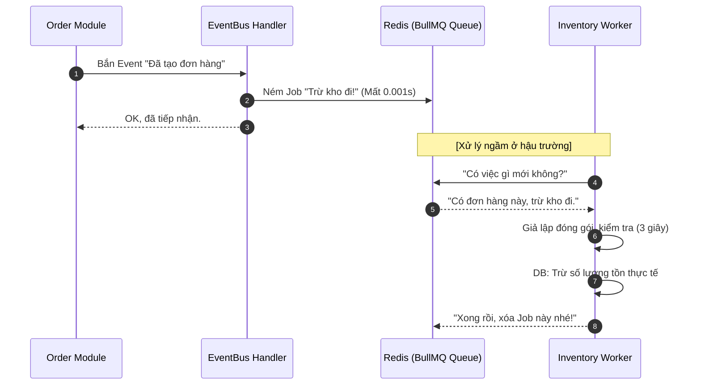

# Kiến trúc: Xử lý Bất đồng bộ với BullMQ & Redis

Hệ thống sử dụng **BullMQ** (một thư viện Message Queue mạnh mẽ cho Node.js) kết hợp với **Redis** để xử lý các tác vụ nặng hoặc không cần phản hồi ngay lập tức cho người dùng.

## 1. Tại sao phải dùng Message Queue?

Trong một hệ thống E-commerce, có những hành động mất thời gian (ví dụ: trừ kho vật lý, gửi email xác nhận, gọi API vận chuyển). 
*   **Nếu xử lý đồng bộ (Sync):** Khách hàng phải đợi xoay vòng tròn trên màn hình cho đến khi mọi thứ xong xuôi.
*   **Nếu xử lý bất đồng bộ (Async):** Chúng ta ném yêu cầu vào một "hàng đợi" và trả kết quả về cho khách ngay lập tức. Một "công nhân" (Worker) sẽ lẳng lặng xử lý yêu cầu đó ở hậu trường.

---

## 2. Mô hình hoạt động (Producer - Queue - Consumer)

### 🚛 A. Producer (Người gửi - `src/modules/products/events/*.handler.ts`)
Khi có một sự kiện quan trọng (ví dụ: `OrderCreatedEvent`), một Handler sẽ đóng gói dữ liệu và đẩy vào hàng đợi (Queue).
*   *Hành động:* `this.inventoryQueue.add('job-name', data)`

### 📦 B. Queue (Hàng đợi - Redis)
Redis đóng vai trò là "nhà kho" chứa các lá đơn (Job). Nó đảm bảo:
*   **Persistence:** Nếu server sập, các Job vẫn nằm an toàn trong Redis.
*   **Concurrency:** Nhiều Worker có thể cùng nhảy vào "ăn" Job một lúc mà không bị trùng lặp.

### 👷 C. Consumer / Worker (Người làm - `src/modules/products/*.processor.ts`)
Đây là những "công nhân" cần mẫn. Họ luôn túc trực bên Queue. Khi thấy có Job mới, họ sẽ nhặt lấy và thực hiện logic thực tế.
*   *Hành động:* `async process(job: Job)`

---

## 3. Ứng dụng thực tế: Luồng Trừ Kho Vật Lý

## 4. Các tính năng cao cấp chúng ta có thể dùng
*   **Retries:** Nếu Worker đang trừ kho mà Database bị khóa (Deadlock), BullMQ sẽ tự động thử lại sau vài giây.
*   **Delayed Jobs:** Có thể đặt lịch: "Hãy gửi email nhắc khách hàng thanh toán sau 2 giờ nữa".
*   **Priority:** Các khách hàng VIP có thể được ưu tiên trừ kho trước.

---

## 5. File cấu hình quan trọng
*   `AppModule`: Nơi kết nối Redis (`BullModule.forRoot`).
*   `InventoryProcessor`: Nơi định nghĩa logic "nhai" Job.
*   `EventsHandler`: Nơi định nghĩa logic "vứt" Job vào Queue.
