# Kiến trúc: Saga Orchestration & Cơ chế Bồi hoàn (Rollback)

Trong một hệ thống phân tán hoặc Modular Monolith, một nghiệp vụ lớn (như Checkout) thường kéo dài qua nhiều module. **Saga Pattern** là giải pháp để đảm bảo tính nhất quán dữ liệu (Data Consistency) mà không cần dùng đến Database Transactions truyền thống (vốn làm giảm hiệu năng và khó mở rộng).

## 1. Vấn đề: Giao dịch phân tán
Khi khách hàng bấm "Thanh toán", hệ thống phải thực hiện 3 hành động ở 3 module khác nhau:
1.  **Payment Module:** Trừ tiền khách hàng.
2.  **Order Module:** Tạo đơn hàng & Giữ hàng trong kho.
3.  **Cart Module:** Đóng giỏ hàng.

**Thách thức:** Nếu bước 1 thành công (đã trừ tiền) nhưng bước 2 thất bại (hết hàng), khách hàng sẽ bị mất tiền oan. Chúng ta không thể "Rollback" Database của Payment từ Module Order.

## 2. Giải pháp: Saga Orchestration
Chúng ta sử dụng mô hình **Orchestration (Bộ điều phối)**. Trong đó, `CheckoutHandler` đóng vai trò là "Nhạc trưởng" điều phối kịch bản:

*   **Happy Path (Luồng thuận lợi):** 
    - Gọi Payment -> Gọi Order -> Gọi Cart -> Thành công.
*   **Compensating Transaction (Giao dịch bù đắp):** 
    - Nếu bất kỳ bước nào sau Thanh toán bị lỗi, Nhạc trưởng sẽ ra lệnh cho Payment Module thực hiện lệnh **Refund (Hoàn tiền)**.

---

## 3. Mô hình hoạt động trong Dự án

```mermaid
sequenceDiagram
    autonumber
    participant Client
    participant Orchestrator as CheckoutHandler
    participant Payment as Payment Module
    participant Order as Order (Stock) Module
    participant Cart as Cart Module

    Client->>Orchestrator: Yêu cầu Checkout
    
    Note over Orchestrator, Payment: [Giao dịch 1]
    Orchestrator->>Payment: Thực hiện ProcessPayment
    Payment-->>Orchestrator: ✅ Captured (Đã thu tiền)

    rect rgb(40, 40, 50)
    Note right of Orchestrator: Bắt đầu khối Try-Catch (Saga Guard)
    Orchestrator->>Order: Thực hiện CreateOrder (Reserve Stock)
    
    alt Nếu Order/Stock Lỗi (Hết hàng/DB Down)
        Order-->>Orchestrator: 💥 ERROR
        Note over Orchestrator, Payment: [Giao dịch bù đắp - Rollback]
        Orchestrator->>Payment: Thực hiện RefundPayment
        Payment-->>Orchestrator: 🚑 Đã hoàn tiền
        Orchestrator-->>Client: Trả về lỗi "Giao dịch thất bại - Đã hoàn tiền"
    else Order Thành công
        Order-->>Orchestrator: ✅ Order Created
        Orchestrator->>Cart: Đóng giỏ hàng
        Orchestrator-->>Client: ✅ Thành công (Hóa đơn)
    end
    end
```

## 4. Tại sao đây là cách làm chuyên nghiệp?

1.  **Dễ theo dõi (Centralized Logic):** Toàn bộ quy trình nghiệp vụ nằm tập trung tại `CheckoutHandler`, không bị phân tán rải rác.
2.  **Tính linh hoạt (Loose Coupling):** Các module khác (Order, Payment) không cần biết về nhau. Chúng chỉ cần thực hiện tốt nhiệm vụ của mình khi được gọi.
3.  **Khả năng phục hồi (Resilience):** Hệ thống tự động xử lý các tình huống lỗi phổ biến trong thương mại điện tử mà không cần sự can thiệp thủ công của nhân viên vận hành.

---

## 5. Lưu ý về Tính nhất quán (Consistency)
Saga cung cấp **Eventual Consistency** (Nhất quán cuối cùng). Có nghĩa là có một khoảng thời gian ngắn (vài giây) dữ liệu có thể chưa khớp nhau, nhưng sau khi chuỗi Saga kết thúc, dữ liệu sẽ được đưa về trạng thái đúng đắn nhất.
